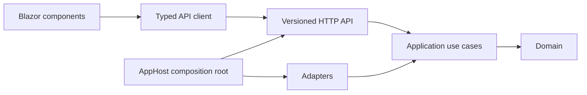

# ADR 0001: Phase 1A modular boundaries

- **Status:** Accepted
- **Date proposed:** 2026-08-23
- **Date accepted:** 2026-09-07
- **Issues:** [#9](https://github.com/Jamula/Andreja/issues/9),
  [#66](https://github.com/Jamula/Andreja/issues/66)
- **Approver:** Cyrus Jamula
- **Governing:** [Platform plan](../plan.md#non-negotiable-engineering-principles)
  and [ADR 0000](0000-plan-ratification.md)
- **Non-authoritative input:** Proposed
  [company charter](../charter.md#decision-and-launch-enforcement)
- **Diagram:** [High-level architecture and data flows](../architecture/andreja-high-level.md)
- **Proposed by:** Spock
- **Decision owner:** Cyrus
- **Decision record:** [Phase 1A packet decision record](../phase-1a/packet-decision-66.md)
  under [#66](https://github.com/Jamula/Andreja/issues/66)

## Context

Phase 1A must prove a task outcome without turning Clean/Onion into
project-per-ring ceremony or coupling the UI to persistence and framework types.

## Decision

Build one modular-monolith deployable. Organize code by business capability,
then enforce inward dependencies inside each module:

```text
src/
  Andreja.AppHost/                 composition root, HTTP API, Blazor host
  Andreja.Api.Contracts/           versioned request/response/tool DTOs
  Andreja.Platform.Contracts/      IDs, policy, proposal, audit contracts
  Modules/
    Identity/
    OpenLoops/
    Assistant/
    Skills/
    Channels/
    Portability/
  Adapters/
    PostgreSql/
    Identity.AspNetCore/
    Assistant.OpenAiCompatible/
    OpenTelemetry/
tests/
```

A module may begin as one project with internal namespaces. Split a compiler
boundary only to prevent an actual forbidden reference or isolate an adapter.
The rules are:

- domain code depends on no framework, SDK, adapter, HTTP, or persistence type;
- application use cases depend on domain code and narrow platform contracts;
- adapters implement application ports and may depend on frameworks/SDKs;
- only `Andreja.AppHost` composes modules and adapters;
- modules exchange IDs, commands, results, domain events, and access-scoped
  projections, never EF entities, navigation properties, or `DbContext`;
- architecture tests reject outward project dependencies and public API leakage.
  Modules currently share one assembly, so namespace review and tests reduce but
  do not compiler-enforce cross-module-internal access. Split a module when that
  enforcement becomes necessary.



Blazor components use the generated or hand-written typed HTTP client even when
co-hosted. They never resolve handlers, modules, or EF services in process. The
server remains authoritative for authorization and validation. API contracts are
versioned, nullable-safe, serialization-tested DTOs and contain no provider SDK or
persistence types.

The first complete vertical slice is:

`assistant request -> typed tool proposal -> policy evaluation -> confirmation ->
Open Loops application use case -> PostgreSQL -> audit/projection -> typed client`.

## Consequences

- One deployable and one process are the default; no service split is implied.
- A separate worker or isolated skill process requires measured execution or
  trust-boundary evidence and a later ADR.
- Contract duplication is preferable to leaking an internal domain model across
  the API boundary.
- Interactive Server is a client rendering choice, not permission to bypass HTTP.

## Cost delta

The accepted baseline adds one application process and one relational store, not a
distributed service estate. Its principal costs are operator time, local compute,
PostgreSQL storage, test maintenance, and future support burden. The modular
monolith avoids service-mesh, queue, duplicated deployment, and cross-service
observability costs. Any process split, managed service, or independently deployed
module requires a new measured cost delta and approval.

## Alternatives considered

- **Microservices or one project per Onion ring:** rejected because Phase 1A has one
  deployable and no measured scaling or trust boundary that justifies distributed
  operations or project ceremony.
- **Let co-hosted Blazor call handlers directly:** rejected because it would leave the
  typed API, authorization, serialization, and independent-client boundary unproven.
- **Share EF/domain types across modules and API contracts:** rejected because it
  couples portability and public shapes to persistence internals.

## Deferred

Cloud topology, Kubernetes, service decomposition, third-party skill execution,
public API compatibility promises, and a graph database remain undecided.
