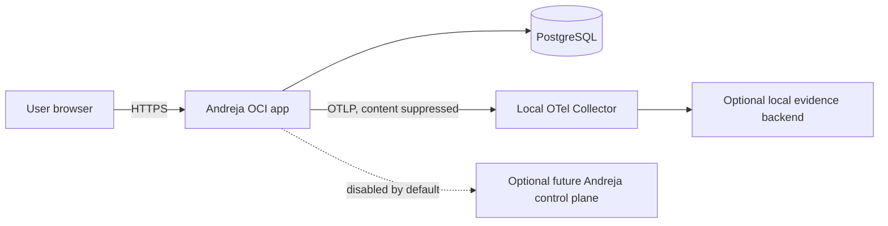

# ADR 0005: Phase 1A independent self-host operations

- **Status:** Proposed
- **Date:** 2026-08-23
- **Issue:** [#9](https://github.com/Jamula/Andreja/issues/9)
- **Governing:** [Platform plan](../plan.md#phase-1a---self-hosted-assistant-walking-skeleton),
  [company charter](../charter.md#commitments), and
  [ADR 0000](0000-plan-ratification.md)
- **Proposed by:** Jett Reno
- **Decision owner:** Cyrus

## Context

Self-hosting is a product boundary, not merely a development topology. Phase 1A must
start, observe, update, stop, back up, and recover without Andreja cloud.

## Decision

Publish one non-root OCI application image and a Compose contract containing:

- the authenticated application;
- PostgreSQL with a durable host-managed volume;
- a local OpenTelemetry Collector;
- an opt-in local evidence profile with a queryable Prometheus-compatible metrics
  backend.

Published Compose references immutable image digests, never `latest`. It declares
health/readiness checks, dependency order, resource guidance, named durable paths,
network boundaries, and validated configuration. The supported Docker-, Podman-, or
other Compose implementation remains a measured host-matrix decision; OCI/Compose
does not select a cloud runtime or orchestrator.

The offline-start proof begins **after image acquisition**. It uses either an image
already preloaded into the host content store, an image built locally from the
checked-out source, or a digest-pinned image served by an operator-controlled local
registry. The proof then removes internet access and starts/restarts the bundle.
“Without GitHub” means startup, operation, restart, backup, and restore do not call
GitHub after the source/image/release metadata has been acquired; it does not claim
first acquisition can occur without a distribution source.

### Keys, secrets, and configuration

- Strongly typed configuration is validated before readiness.
- TLS, Data Protection, envelope-encryption, and operator-recovery key material live
  outside the image and database in least-privilege host mounts.
- Historical keys required for cookies, identity, or encrypted data are retained
  according to a documented rotation inventory.
- BYOK/provider credentials are encrypted at rest and excluded from application
  exports and telemetry.
- Local development certificates are never accepted as a production default.

### Backup, update, and recovery

The operator runbook performs a consistent database logical dump, snapshots the
required key/config inventory, records image/config/schema versions and checksums,
encrypts the recovery set, and verifies it by restoring into a clean instance.
Portable application export is exercised separately.

Updates are pull-by-digest, inspect release/migration notes, back up, run the explicit
migration artifact, start the new revision, verify readiness and sign-in, then
retire the old revision. Rollback uses the prior image only when schema-compatible;
otherwise it restores the pre-update recovery set.

### Independent and content-safe operation

Normal identity, assistant BYOK, skills, tasks, audit, export, backup, and restore
have no Andreja-cloud dependency. Default egress is limited to the user-configured
assistant endpoint; an offline fake-provider smoke test proves there are no hidden
calls. OTel uses an allowlist of low-cardinality operational attributes and rejects
task text, prompts, responses, tokens, raw user identifiers, and connector content.

## Local/paper Phase 0 evidence

This ADR is documentation only. Phase 0 may inspect OCI/Compose/PostgreSQL/OTel
documentation and existing local capabilities, but creates no cloud account,
subscription, free tier, trial, or provisioned resource. No runtime, tool, provider,
or package is installed by this decision.

## Alternatives considered

- **Build or pull from GitHub on every start:** rejected because distribution
  availability would become a runtime dependency and make offline evidence invalid.
- **Use mutable tags:** rejected because update, rollback, and evidence could not bind
  to one artifact.
- **Require Kubernetes or a managed control plane:** rejected because one-user Phase
  1A has no measured need and must remain independently operable.

## Human decision

Cyrus must approve the supported host/runtime matrix, HTTPS/passkey onboarding,
key-custody and backup destinations, update signature/distribution policy, local
evidence backend, and recovery objectives.
