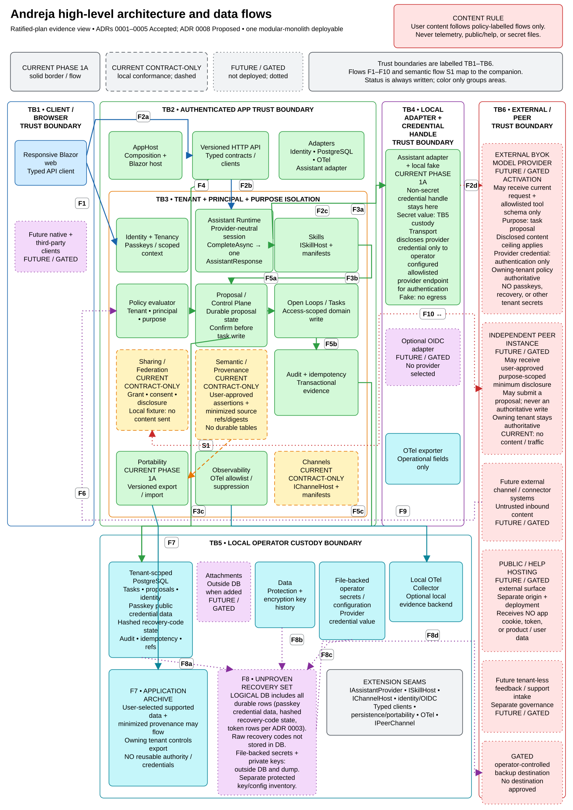

# Andreja high-level architecture and data flows



Use the [editable Excalidraw source](andreja-high-level.excalidraw) for changes.
The [PNG export](andreja-high-level.png) is available for viewers that do not
render SVG. This view summarizes the ratified [platform plan](../plan.md) and
[ADRs 0001–0005](../adr/0001-phase-1a-modular-boundaries.md); those documents
remain normative.

## Scope and notation

This is an evidence view of `origin/main` at commit `e93a538` on 2026-08-24.
"Current" means implementation or operational evidence is present in that
snapshot; it is not a production-readiness or availability claim.

| Notation | Meaning |
|---|---|
| **CURRENT PHASE 1A** — solid | Implemented walking-skeleton component or exercised local operational path. |
| **CURRENT CONTRACT-ONLY** — dashed | Application-owned contract and deterministic local conformance proof; no live external service, listener, connector, or durable future-state schema is implied. |
| **FUTURE / GATED** — dotted | Phase 1B+ or separately approved work. Technology, topology, and provider choices remain undecided unless an ADR says otherwise. |
| **TB1–TB6** | Named trust boundary. Color supplements the boundary label; it is never the only indicator. |
| **F1–F10** | Numbered flow described below. **Solid** = current, **dashed** = contract/local conformance, and **dotted** = future/gated. |

Status is encoded only by the explicit status words and border/flow style. Colors
group architectural areas (clients, app/core, contracts, custody, and external
boundaries); color never changes or substitutes for lifecycle status.

The diagram deliberately omits detailed classes, infrastructure SKUs, cloud
topology, endpoints, tenant/user examples, credentials, recovery material, and
provider endorsements.

## Trust boundaries

| Boundary | Responsibility |
|---|---|
| **TB1 — client/browser** | The responsive Blazor client uses typed HTTP contracts. Future native or third-party clients must cross the same server-authoritative API boundary. The separately deployed public/help site has no app cookies, tokens, or product-data access. |
| **TB2 — authenticated app** | `Andreja.AppHost` composes the modular monolith, HTTP API, modules, and adapters. Co-hosting does not permit UI components to bypass HTTP authorization and validation. |
| **TB3 — tenant/principal/purpose isolation** | Scoped context, policy, access-scoped projections, and tenant-aware PostgreSQL constraints enforce ownership and purpose. IDs are not capabilities. |
| **TB4 — adapter/provider** | Framework, persistence, identity, assistant-provider, connector, and telemetry integrations remain outer adapters. Credentials do not enter modules, manifests, prompts, exports, or telemetry. |
| **TB5 — local operator custody** | PostgreSQL, key history, file-backed configuration/secrets, local telemetry, exports, and recovery sets remain under operator control. Database, keys, and configuration have distinct backup and portability roles. |
| **TB6 — external/peer** | Model providers, future connectors, peer instances, support intake, and backup destinations are separately trusted systems. Inbound content is untrusted data; every outbound user-content flow needs an explicit purpose and policy. |

## Numbered flows

| Flow | Path and controls |
|---|---|
| **F1 — passkey sign-in** | Browser -> authenticated identity adapter -> scoped tenant/principal context. HTTPS and WebAuthn origin checks apply. Passkeys, bootstrap/recovery material, and reusable credentials are excluded from logs, telemetry, database exports, and application exports. |
| **F2 — assistant request** | Typed client/API -> assistant runtime -> user-configured BYOK provider or deterministic local fake. User content may cross TB4 only for the configured provider and disclosed purpose; encrypted credential handles remain with the adapter. |
| **F3a–F3c — typed tool and durable proposal** | Assistant runtime -> allowlisted typed tool -> `ISkillHost` schema and grant/capability/purpose validation -> exact proposal with provenance and expiry. The path cannot bypass the skill host. Skill execution does not mutate the task domain; Proposal/Control Plane persists proposal lifecycle state to PostgreSQL via F3c before confirmation. That durable proposal record is not task creation. |
| **F4 — human confirmation** | Browser/typed API -> Proposal/Control Plane. Confirmation binds proposal version, actor, tenant, and idempotency key. Rejection or expiry produces no domain write. |
| **F5a/F5b/F5c — proposal-driven task creation and audit** | Confirmed Proposal/Control Plane -> Open Loops application use case and policy re-evaluation -> transactional audit/idempotency evidence -> tenant-scoped PostgreSQL. The split visual path makes each required stage explicit: assistant/proposal-driven task creation cannot bypass confirmation, the Open Loops use case, or transactional audit/idempotency. Direct user actions such as complete or delete remain separately server-authorized and audited; they do not require a proposal. |
| **F6 — future external intake policy** | Future external input must cross a future adapter/`IChannelHost` seam and terminate at the shared Policy evaluator. Capability, purpose, operation, data class, grant, consent, and disclosure ceilings intersect fail-closed. The dotted route does not enter the contract-only Channels component and does not imply a live connector or provider selection. |
| **F7 — application portability** | Versioned export/import archive with checksums and a write-free dry run. Supported user data and minimized provenance may move; credentials, passkeys, provider handles, Data Protection keys, caches, and external authority do not. |
| **F8a–F8d — gated recovery proof** | PostgreSQL logical backup/restore tooling exists; the runbook separately requires operator-managed Data Protection key and configuration inventories, but no dedicated inventory tool or combined proof is claimed. Dotted F8a–F8c inputs show the required database, key-history, and file-backed-configuration parts of an unproven recovery set; F8d leads to an unapproved operator destination. The database-only clean-instance rehearsal passed, but encrypted DB-plus-key recovery-set custody and restored app sign-in with restored keys remain **PARTIAL / BLOCKED**. This is distinct from application portability. |
| **F9 — telemetry suppression** | The app exports allowlisted, low-cardinality operational fields to the local OpenTelemetry Collector. Task text, prompts, responses, tokens, identifiers, credentials, and connector content are prohibited. |
| **F10 — purpose-scoped sharing/proposals** | Current local contracts cover grants, bilateral consent, disclosure levels, minimized audit, and signed peer envelopes. A future peer may submit a purpose-scoped proposal; the owning tenant remains authoritative. Phase 1A has no live peer listener, discovery, relay, or federation traffic. |

## Components, stores, and custody

- `Andreja.AppHost` is the composition root and one current deployable; the
  diagram does not predict a service split.
- Current modules cover identity/tenancy, assistant runtime, Open Loops,
  proposals, first-party skill execution, portability, audit/idempotency, and
  content-safe observability.
- Channel, sharing/federation, and semantic-profile/provenance seams have local
  contracts/conformance fixtures. Their dashed notation prevents those seams
  from being mistaken for live integrations or durable future tables.
- PostgreSQL is the current tenant-scoped relational store. Attachments outside
  the database are shown as gated because Phase 1A does not select an object
  store or claim a live attachment path.
- Data Protection/encryption key history and operator secrets/configuration are
  outside the image and database. They are not application-export content.
- PostgreSQL backup/restore tooling and a database-only clean-instance rehearsal
  exist. Key/configuration inventory is operator-managed and the encrypted
  combined custody plus restored sign-in with restored Data Protection keys
  remain partial/blocked. The dotted recovery nodes are evidence gaps, not
  current destinations or successful recovery claims.
- The public/help site and optional tenant-less feedback intake are separately
  deployed, future-gated surfaces with no privileged route to user data.

## Extension seams

| Seam | Contract intent and present status |
|---|---|
| `IAssistantProvider` / `IAssistantSession` | Current provider-neutral capability negotiation, typed-tool allowlist, structured events, cancellation, and content-free usage. |
| `ISkillHost` / `SkillManifest` | Current first-party, typed, policy-evaluated skill boundary. No unrestricted network, filesystem, secrets, `DbContext`, or service locator access. |
| `IChannelHost` / `ChannelManifest` | Current local conformance seam; external channel adapters are future-gated. |
| Identity/OIDC adapters | Built-in ASP.NET Core passkey adapter is current. Optional BYO OIDC and managed identity choices require separate approval/evidence. |
| Typed API clients/contracts | Current reversible client boundary for responsive web and future clients. Contracts contain no EF, framework, or provider SDK types. |
| Persistence/portability adapters | Current PostgreSQL and versioned application export/import boundaries. No second relational provider or object store is claimed. |
| OpenTelemetry exporters | Current standards-based, content-suppressed local export seam. Remote destinations require a separate purpose/privacy/retention review. |
| `IPeerChannel` / signed envelopes | Current local conformance contract; live federation, discovery, trust bootstrap, relay, and interoperability are future-gated. |

## Ownership, review, and revalidation

**Owner:** Core Platform and Architecture. **Decision owner:** Cyrus.

Revalidate and update the Excalidraw source plus both exports whenever a pull
request changes any trust boundary, module/deployable, durable store or custody
rule, external data flow, status classification, or extension contract. The PR
author must complete this checklist:

- [ ] Spock: architecture, current/future status, and no accidental topology claim.
- [ ] Tuvok and Deanna Troi: trust, authorization, secret, consent, and privacy flows.
- [ ] Seven of Nine and Jett Reno: assistant, skill, channel, peer, provider, portability, and telemetry seams.
- [ ] Data: source/render consistency and flow-to-document mapping.
- [ ] Jadzia Dax: label clarity, color-independent legend, contrast, normal-width readability, and no clipped/invisible text.
- [ ] Open the `.excalidraw` source at <https://aka.ms/excalidraw>; inspect at fit-to-screen and 100% zoom.
- [ ] Regenerate and verify artifacts:

  ```powershell
  python scripts\docs\generate_architecture_diagram.py --render-png
  python scripts\docs\generate_architecture_diagram.py --check
  python scripts\docs\test_architecture_diagram.py
  python .github\scripts\check_docs_consistency.py
  ```

The generator derives the editable source and SVG from one model, embeds the
source SHA-256 in the SVG, and writes source, SVG, raster, and combined binding
SHA-256 values into validated PNG chunks. `--check` validates PNG structure and
CRC values, verifies the cryptographic binding, and compares the complete PNG
bytes against the committed SHA-256 manifest. Extra metadata, EXIF, animation,
or other chunks fail even if the manifest is regenerated: only `IHDR`,
contiguous `IDAT`, the exact four provenance `tEXt` chunks, and `IEND` are
allowlisted. The hosted Docs Consistency workflow enforces this portable check;
`--render-png` atomically regenerates both the image and manifest with Edge. A
manual Microsoft-internal Excalidraw review remains required because byte-level
checks cannot detect visual clipping or misleading layout.
