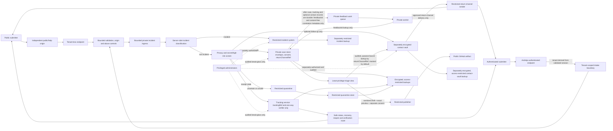

# Feedback security, abuse, and incident-routing decision

## Status and authority

- **Status:** Proposed for Cyrus decision; implementation and activation remain blocked
- **Decision issue:** [#156](https://github.com/Jamula/Andreja/issues/156)
- **Parent framework:** [Feedback and support](feedback-support.md)
- **Privacy dependency:** [Feedback privacy, retention, and data-subject rights decision](../legal/feedback-privacy-retention-dsr.md), issue [#155](https://github.com/Jamula/Andreja/issues/155), PR [#172](https://github.com/Jamula/Andreja/pull/172)
- **Threat-model baseline:** [Canonical descriptive threat model](../threat-model.md), issue [#116](https://github.com/Jamula/Andreja/issues/116), PR [#117](https://github.com/Jamula/Andreja/pull/117)
- **Accountable owner:** Tuvok
- **Operational co-lead:** Jett Reno
- **Required reviewers:** Deanna Troi, Guinan, Data, and Quark
- **Decision authority:** Cyrus Jamula
- **Decision version:** `feedback-security-v1`

This supplement makes the future feedback boundary concrete enough to review. It
does not authorize collection, publication, provider selection, spend,
provisioning, deployment, public intake, or support-time commitments. No
unapproved provider default, threshold, retention period, or legal/security
exception may be selected by an implementer.

## Recommended decision

Approve the security direction and mandatory controls below, subject to the
blocking dependencies and evidence gates in this document. Approval of the
direction would not approve any unmeasured abuse limit, provider, deployment,
incident contact, or activation. Keep the affected route disabled until its
specific blockers are resolved and Cyrus separately authorizes the applicable
stage.

## Evidence and current status

The following are the inspected source facts; they are not claims that a live
intake service or its controls have been tested:

| Evidence | What it establishes | What it does not establish |
| --- | --- | --- |
| [Feedback framework](feedback-support.md), especially its channel, tenant-less flow, privacy/security controls, abuse, severity, and tracking sections | Intake is future/gated; public intake is a separate tenant-less service; security/privacy incidents leave ordinary triage; attachments are off by default; secret handling and non-enumerating behavior are required. | A deployed endpoint, queue, store, threshold, key custodian, or tested incident route. |
| [Threat model](../threat-model.md) and [#116 / PR #117](https://github.com/Jamula/Andreja/pull/117) | The canonical baseline is descriptive and not ratified; it explicitly says there is no current live support intake, public site, or cloud data plane. Its public/support row is future/gated. | An intake-specific STRIDE/LINDDUN review, classification/impact assessment, independent challenge, or Cyrus residual-risk acceptance. |
| [Privacy decision package](../legal/feedback-privacy-retention-dsr.md) and [#155 / PR #172](https://github.com/Jamula/Andreja/pull/172) | Proposed roles, rights proof, and suggested retention schedules exist. The document remains “Proposed for Cyrus approval”; the issue's last Cyrus comment requests an explicit `APPROVE`, `AMEND`, or `REJECT` result. | Approval of the proposed retention durations, holds, legal hypotheses, processors, or activation. The current closed issue state and merged PR are not a decision. |
| [`SECURITY.md`](../../SECURITY.md) and [private-reporting issue-form link](../../.github/ISSUE_TEMPLATE/config.yml) | The repository documents a private vulnerability-reporting surface at `https://github.com/Jamula/Andreja/security/policy` and tells reporters not to disclose sensitive content publicly. | That the GitHub surface is enabled and usable by intended reporters, a separately tested personal-data-incident route, or a published `security.txt`. No `security.txt` file was found in the repository. |

No implementation, live endpoint, or negative-test result is included in these
sources. Every runtime and exact-release evidence item below is therefore
**Blocked / unavailable**, not passed.

## Intake-specific data flow and trust boundaries

This is the required design boundary, not a statement that these components
exist. The source channel is server-assigned. A public request must never acquire
an Andreja tenant identity or enter a tenant data plane.

### Boundary invariants

1. The public origin has no Andreja app cookie, user token, tenant lookup, or
   path to tenant data. The public endpoint rejects tenant identifiers rather
   than trusting, accepting, or partitioning by them.
2. An authenticated request derives its tenant only from a validated server
   session. Every read and mutation authorizes both tenant and record ownership
   in the service/data boundary; a client-supplied tenant or record ID is never
   authorization.
3. `sourceChannel` and incident classification are assigned or verified by the
   server. Incident submissions pass through bounded validation, origin and
   abuse controls and the bounded private incident ingress before
   classification; authenticated submissions originate only after validated
   session and tenant-boundary checks. Client fields cannot route an incident
   into ordinary triage or authorize publication.
4. Queue and provider metadata contain only internal random IDs and
   content-free correlation data. Case text, contact destinations, receipt
   secrets, tenant IDs, incident detail, and screening excerpts do not enter
   logs, traces, metrics, alerts, email metadata, analytics, or public systems.
5. Raw return destinations exist only in the separately encrypted contact
   vault; ordinary case records contain only `returnChannelRef`. Lookup is
   purpose-bound and access-logged, triage displays a masked destination by
   default, and the raw destination is released only for an approved
   return-channel send. The contact vault and its separately encrypted,
   access-restricted backups have distinct least-privilege access and inherit
   deletion/hold rules; restore must not revive a deleted destination. The
   contact vault, tracking verifier store, ordinary case store, quarantine,
   incident system, and backups have distinct least-privilege roles and
   deletion/hold propagation. Ordinary triage does not browse raw queues,
   databases, backups, or incident evidence.
6. The publisher can read only an approved sanitized draft and its exact
   consented version. Security/privacy-classified records, secret detections,
   and incident records are not publishable.
7. Administrators are a separate trust boundary. Administrative access is
   least-privileged, time-bounded where supported, access-logged, reviewed, and
   cannot silently bypass tenant, incident, retention, or publication policy.
   Host/root/key custody risks remain even when application authorization is
   correct.
8. Backups, replicas, exports, quarantines, and dead-letter stores inherit the
   record classification, access restrictions, retention, deletion, and scoped
   hold rules. Restoring a backup must not revive a revoked receipt verifier or
   deleted record.

## STRIDE and LINDDUN model

| Threat | Attack or privacy harm | Required control and evidence | Owner |
| --- | --- | --- | --- |
| **S — Spoofing** | Forged source channel, guessed tracking reference, stolen session, or forged private-incident submission impersonates a reporter or crosses a route. | Server-assigned channel; validated session and origin; 256-bit proposed random tracking secret; verifier-only custody; private-route ownership proof where required; enumeration and session-boundary negative tests. | Tuvok; Jett Reno operationally |
| **T — Tampering** | Client changes tenant, record owner, severity, classification, consent, status, dedupe link, or published draft after review. | Derive authorization and route server-side; validate allow-listed schema; bind consent to exact draft digest/version; recheck authorization and consent at each mutation/publication; tampered-field and stale-draft tests. | Tuvok; Guinan for triage; Data for tests |
| **R — Repudiation** | Reporter or operator disputes receipt, consent, rotation, publication, incident handoff, or deletion. | Content-minimized, append-only event evidence keyed by opaque IDs; record actor role, action, time, result, policy/version, and correlation ID; never log body or secret. Retention and operator-trust limits remain governed by #155 and the approved incident policy. | Jett Reno; Deanna Troi; Tuvok |
| **I — Information disclosure** | Cross-tenant reads, receipt-secret leakage, contact exposure, incident/publication leak, or content in telemetry, queues, email, backups, or GitHub. | Distinct stores/roles, transport and at-rest encryption, verifier-only secret storage, output minimization, no secret URLs, redaction canaries, backup controls, incident isolation, and negative tests across every boundary. Key custody/rotation and exact runtime evidence are blockers. | Tuvok; Deanna Troi; Jett Reno |
| **D — Denial of service** | Flooding, oversized payloads, challenge abuse, expensive screening, queue saturation, retry storms, or deliberate dead-letter growth prevents safe intake. | Enforceable request/body/time/concurrency limits before costly work, per-route and coarse network rate limits, bounded retries/queues/quarantine/dead letters, budget alarm/stop, backpressure, and no-ack-before-durable-acceptance. Numerical limits and load evidence are blocked. | Jett Reno; Quark; Data |
| **E — Elevation of privilege** | Triage, publisher, support, or administrator uses a route or broad store access to read incidents, other tenants, contact data, or unpublished content. | Separate roles and views; deny-by-default authorization; restricted incident and contact access; audited break-glass; independent negative authorization tests and review evidence. | Tuvok; Jett Reno |
| **L — Linkability** | Tracking, duplicate matching, or anti-abuse signals link a submitter across cases, channels, tenants, or sessions. | Random non-semantic references; no contact/IP/tenant-based dedupe; short-lived coarse signals only; source-boundary checks; no durable cross-site profile. #155's suggested signal retention remains unapproved. | Deanna Troi; Tuvok; Guinan |
| **I — Identifiability** | Free text, diagnostics, contact details, or response metadata identifies submitters or non-user subjects. | Minimize by default; per-field consent; screen before ordinary triage; separately encrypt contacts; use masked destinations; avoid content in metadata; test redaction and non-user-subject handling. | Deanna Troi; Guinan |
| **N — Non-repudiation / harmful over-retention** | Abuse evidence, consent receipts, or audit trails become durable profiles or are retained beyond a purpose. | Purpose-bound minimized records, explicit approved expiry/purge, no indefinite default, scoped documented holds, monthly review for any proposed severe-abuse extension, and deletion/reconciliation evidence. #155 approval is a blocker. | Deanna Troi; Tuvok; Sarek |
| **D — Detectability** | Response timing, status, challenge, duplicate result, or recovery behavior reveals a record or incident to a guesser. | Non-enumerating response contract for accepted, quarantined, rejected, duplicate, missing, and incident paths; same outward status/body and bounded timing class; guessed/missing/stale-reference tests. No existence detail before proof succeeds. | Tuvok; Data |
| **D — Disclosure** | Private vulnerability or personal-data-incident material reaches ordinary triage, email, GitHub, a provider, or unrelated reporters. | Separate private incident system and role; minimum safe acknowledgment; restricted reference only in ordinary workflow; no public issue/PR; incident-route and publication-denial tests. Route availability is unverified. | Tuvok; Deanna Troi; Guinan |
| **U — Unawareness / non-compliance** | Notice or consent does not describe actual fields, route, recipients, retention, or risk; a user cannot appeal a false positive accessibly. | Review the final form/notice against the deployed contract; provide accountless private appeal and accessible non-bot alternative; no collection until #155 and accessibility evidence pass. | Deanna Troi; Guinan; Data |

## Abuse-control decision register

Each row is a proposed rule and identifies its decision/evidence gap. A blocked
threshold is not permission to choose a default. The retention periods below
are proposals in the #155 privacy package, not approved schedules.

| Control | Owner | Threshold or decision rule | Evidence retention | False-positive / accessible path | Cost bound | Degraded mode |
| --- | --- | --- | --- | --- | --- | --- |
| Schema, body size, parser, timeout, and concurrency bounds | Jett Reno; Tuvok security review; Data tests | Reject unknown fields, malformed encodings, non-allow-listed values, and any request above the approved numeric byte/time/concurrency caps **before** unbounded allocation or expensive screening. The actual caps require measured synthetic-load evidence and Cyrus approval; none is in the inspected evidence. | Do not retain rejected body content. Keep only content-free result/correlation data under an approved operations schedule; #155's proposed abuse-signal schedule is pending. | Generic private appeal for a rejected/blocked request; accessible form validation and an alternate route that does not require a bot challenge. Never echo the submitted value. | No external spend or provider call is authorized. Before activation, Jett and Quark must bound CPU, memory, queue, and per-request cost with a hard stop; no numeric budget is evidenced. | Before durable acceptance, fail closed with a generic retry/alternate-route message; after durable acceptance, retain and queue it. Never return success-shaped acknowledgment for lost data. |
| Endpoint rate, burst, and repeated-attempt limiting | Jett Reno; Tuvok; Quark | Enforce separate endpoint and coarse network limits plus a global ceiling. No numeric rate/window/cap is approved; derive candidates from synthetic load and abuse testing, then record a measurable ceiling and stop rule before activation. Do not use cross-site profiles or contact/tenant identifiers as rate keys. | #155 proposes raw/coarse signals for 24 hours, aggregate endpoint counters for 30 days, and escalated evidence for 90 days after last event; severe-abuse extension up to one year requires a documented reason and monthly review. All remain pending #155 approval. | Appeal through the private accessible route using a generic challenge/reference; allow an accessible alternative and human review. Do not require a social login, public issue, or persistent behavioral profile. | Hard zero external spend before approval. Challenge, storage, and compute have no approved unit-cost or capacity envelope; Quark/Jett must set those from evidence. | Shed unauthenticated excess work before screening; keep a separate protected incident route; if unavailable, disable the affected route and show only a pre-approved private alternative. |
| Bot challenge or equivalent friction | Jett Reno; Guinan accessibility; Tuvok security | Use only when measured abuse justifies it; no advertising tracker, cross-site fingerprint, or default challenge. Challenge activation and trigger require accessibility/usability evidence and Cyrus approval. | Retain only challenge result and minimum short-lived abuse signal under the pending #155 proposal; never retain a behavioral profile. | Provide a tested accessible alternative and private appeal that remains usable by people with disabilities and shared/locked-down devices. | No paid challenge service or external call is authorized; implementation must fit the approved per-request budget. | If challenge provider/control is unavailable, do not weaken limits; apply bounded local controls or temporarily disable new public intake with a safe alternate contact. |
| Secret, credential, personal-data, threat, and high-risk-content screen | Tuvok; Deanna Troi privacy; Guinan triage | Use allow-listed fields and detectors as a screening signal, never as proof that a payload is safe. Any suspected secret, vulnerability, cross-tenant disclosure, or personal-data incident is restricted and routed privately, not ordinary spam. Detector scores/cutoffs need corpus-free synthetic tests and an approved threshold; none is evidenced. | Do not copy matched snippets into logs or reason codes. #155 proposes quarantined submissions for 30 days from quarantine; escalation transfers only a minimized subset to a restricted incident record. Approval and hold rules remain blockers. | Human restricted review; private appeal/clarification with no sensitive echo. Offer accessible manual route. A suspected incident must not be rejected solely as spam or made public to appeal. | No paid scanning/provider use. Bound CPU/memory and per-request work before activation; no measured ceiling or cost data is available. | Quarantine uncertain content; if restricted review is unavailable, hold it outside ordinary triage and stop accepting affected content rather than auto-release or silently drop it. |
| Deduplication, burst detection, and idempotency | Guinan; Deanna Troi privacy; Data tests | Screen before dedupe and partition candidate sets before similarity lookup. `PublicSite` searches only tenant-less public cases and sanitized public GitHub issues allowed by the framework. `AuthenticatedApp` searches only active/recent feedback authorized within the tenant derived from the validated session; exclude public, repository, and all other-tenant candidates. Never compare public and authenticated submissions or authenticated records across tenants. Tenant context is an authorization/query partition only, not a similarity key, score feature, or input. Within the selected set, compare only approved sanitized category/surface/version/outcome/error fields; no contact, IP, tenant ID, excluded content, or cross-boundary private identifiers. Similarity never auto-merges. Enforce one state transition per idempotency key. | Keep only the minimized relationship key and result under the approved case retention schedule; #155's schedule is proposed, not approved. Do not retain raw duplicate payloads for matching. | Guinan confirms candidate matches; reporter retains an independent receipt/status path and may appeal a mistaken duplicate. Provide an accountless accessible path. | Bound candidate comparisons/index work per request and total storage; no numeric ceiling or cost evidence exists. | On index/lookup failure, do not auto-declare duplicate or lose the new accepted record; preserve it privately for manual review or stop intake before acceptance. |
| Queue, quarantine, dead-letter, retry, and backpressure | Jett Reno; Quark cost; Data tests | Bound queue depth, item bytes, retry count/backoff, dead-letter size/age, and quarantine capacity; alert and stop at explicit measured ceilings. None of the required numeric ceilings, SLOs, or cost cap is approved. | Apply the source record's approved classification and retention; #155 proposes 30-day quarantine and retention for escalated abuse evidence as above. Backup/dead-letter purge and hold propagation must be exercised. | Manual restricted review and private appeal; no automatic deletion of accepted records as a capacity shortcut. | No provisioning or spend; hard resource and cost ceiling must be approved before service selection/activation. | Acknowledge only after durable acceptance. Backpressure before acceptance returns a uniform safe unavailable response; accepted items stay durable and visible to authorized operators. If incident capacity fails, suspend ordinary intake or provide a tested alternate private route. |
| Receipt secret, status, recovery, rotation, CSRF, and replay protection | Tuvok; Jett Reno implementation; Data tests | Generate at least 128 bits of CSPRNG entropy (recommend 256 bits); show raw secret once; persist only a one-way verifier. Never put it in URL, history, referrer, logs, traces, metrics, alerts, queues, backups, or provider metadata. Require origin validation, browser CSRF protection, nonce-bound/single-use replay protection, and idempotency for every state change. CAS/transactional rotation must leave exactly one prior credential valid on failure and only one credential valid after success. | Store only verifier and strictly necessary expiry/throttle/recovery/revocation metadata; use #155's proposed tracking expiry (180 days after closure) only after Cyrus approves it. Minimize security event records per the proposed, unapproved abuse schedule. | Recovery requires approved proof or verified return channel; uniform response before proof, new secret after proof, old verifier atomically revoked. Lost receipt has an accountless accessible private route; appeal does not reveal record existence. | No external spend. Bound cryptographic work and throttling storage from synthetic evidence; key custody/rotation and unit-cost evidence remain open. | If proof, verifier store, key, nonce, or atomic rotation is unavailable, deny the mutation without invalidating the last valid credential; preserve safe read-only behavior only if independently authorized. |
| Incident classification, private route, and public publication guard | Tuvok; Deanna Troi; Guinan; Jett Reno | Any suspected vulnerability, secret exposure, unauthorized cross-tenant access, or personal-data incident exits ordinary triage. No publication, standard outbound email, or public issue. Validate the private route with safe synthetic reports before exposure. `security.txt` and verified private vulnerability/data-incident routes are pre-activation gates. | Preserve only minimized evidence in the separately approved restricted incident record and for its approved schedule; no schedule/hold authority is inferred from issue closure. | Acknowledge without detail; provide an accessible private alternative and safe appeal/contact path. Never ask for sensitive evidence in public. | No incident vendor/account/spend authorized; incident processing and response capacity must fit a separately approved ceiling. | If the private route is unavailable, disable intake/publication and use only a pre-approved private alternative. Never fall back to GitHub public issues or ordinary support. |
| Attachments | Tuvok; Guinan; Data | Disabled in v1. Reject before durable storage; enabling requires a separate approved type/size allow-list, scanning, quarantine, accessibility, consent, and retention package. | No stored attachment content; verify failed uploads leave no durable bytes. | Provide text-only accessible reporting and an approved private alternative; do not make attachments necessary to report a vulnerability. | No scanning/proxy/storage spend authorized. | Reject uploads safely; do not silently accept or retain them when scanners or quarantine are unavailable. |

## Receipt and state-transition contract

1. Generate an unpredictable, non-semantic `trackingRef` and a separate
   one-time receipt secret using a CSPRNG. The secret has at least 128 bits of
   entropy; this package recommends 256 bits.
2. Store only a one-way verifier, the non-secret reference, and the minimum
   approved expiry, throttle, recovery, rotation, and revocation metadata. Never
   persist the raw secret or an encrypted/recoverable equivalent.
3. Return the raw secret once only after the relevant minimal status object is
   durable. The response never includes submitted content, screening matches,
   incident classification, duplicate target, private owner, tenant, or internal
   case ID.
4. For accepted and quarantined submissions, use the same non-revealing
   acknowledgment. For rejected, duplicate, missing, and incident cases,
   implement a single tested outward response contract that does not reveal
   record existence or route before proof. The exact minimal ticket/stub
   treatment for non-accepted cases is a policy/storage decision not specified
   in the approved framework and is therefore a blocker; do not ship a
   distinguishable response as a default.
5. Status, reopen, verify, recovery, and rotation require proof; a display
   reference alone is never an authenticator. Before proof succeeds, missing,
   guessed, stale, revoked, and inaccessible references receive equivalent
   outward responses.
6. For browser state changes, enforce CSRF protection and exact allowed-origin
   validation. Bind replay nonces to the action/session and consume them
   atomically. Idempotency prevents duplicate transitions but cannot authorize
   an action.
7. Rotation is atomic: install the new verifier and revoke the old verifier in
   the same transaction/CAS commit. Return the new raw secret only after that
   commit. A failed transaction leaves exactly the prior credential valid;
   concurrent rotations have one committed winner, and no successful response
   may leave two valid secrets.
8. Use generic, non-enumerating outcomes for accepted, quarantined, rejected,
   duplicate, missing, and incident cases; never reflect prohibited content.
   Bound response timing classes and avoid status differences that reveal
   screening, record, or incident existence.

## Private incident routing

| Trigger | Required route | Ordinary feedback behavior |
| --- | --- | --- |
| Suspected vulnerability, exploit, or secret exposure | Restricted security incident owner (Tuvok) using the approved private vulnerability route; Jett Reno contains relevant service exposure. | Stop normal screening, dedupe, and publication. Acknowledge without detail; send only a restricted reference to ordinary triage if needed. |
| Suspected personal-data loss, unauthorized access/disclosure, or cross-tenant exposure | Restricted privacy/security incident owners (Deanna Troi and Tuvok); Sarek advises on legal/counsel escalation; Jett Reno contains affected systems. | Suspend the affected route and ordinary access/publication. Preserve only minimized authorized evidence; do not put details in public issues, PRs, email subjects, or public incident records. |
| Threats, harassment, illegal content, or urgent safety risk | Authorized restricted reviewer; Tuvok/Deanna Troi and counsel as appropriate; Cyrus decides extraordinary resourcing. | Restrict access, do not echo or republish content, use the approved safe contact/escalation rule, and preserve no more than approved evidence. |

The repository currently documents a private vulnerability surface, but this
review did not verify its live availability or exercise a data-incident
submission. No `security.txt` file is present in the repository, and the
published contact/route owner, expiry, and incident-response handoff have not
been evidenced. Create and validate an accurate `/.well-known/security.txt` and
test both private vulnerability and personal-data-incident routes before any
public intake activation. Do not publish placeholder contact details or route
sensitive reports to a public issue, PR, ordinary support inbox, or GitHub
discussion.

## Required negative and failure-path evidence

All scenarios below are **Blocked / unavailable** until implemented in an
explicitly approved non-production test boundary and run against the exact
release candidate. Synthetic fixtures must contain no real person, tenant,
credential, prompt, or incident content.

| Scenario | Required result |
| --- | --- |
| Public request supplies a tenant ID, tenant key, or authenticated-user field | Reject/ignore it at the public boundary; no tenant lookup, tenant partition, or tenant-data read/write occurs. |
| Authenticated session from tenant A accesses or mutates tenant B's case, or one record's receipt/session is used against another | Deny; no data, status, contact, dedupe, or mutation crosses records or tenants. Verify every read and mutation path. |
| Public tenant-less record ID, cookie, receipt, or correlation value is replayed against authenticated or incident service | Deny; no trust or credential is shared across those boundaries. |
| Guessed, collided, missing, duplicate, stale, revoked, expired, and valid-but-unproved references are queried | No record-existence, category, duplicate, incident, or tenant signal before proof; all pre-proof results satisfy the same outward response contract. Collision insertion retries safely without aliasing a record. |
| Wrong, stale, revoked, replayed, or concurrently used secret/nonce; CSRF request; hostile or missing `Origin` | Deny state change; no secret or sensitive detail in response; no duplicate transition. |
| Recovery, rotation, storage failure, process crash, and two concurrent rotations | Recovery requires approved proof, issues a new secret, and invalidates old verifier atomically. Failure leaves exactly the previously valid credential; concurrent success leaves only one valid credential. |
| Malformed, oversized, slow, burst, concurrent, duplicate, and high-cost submissions | Enforced measured bounds hold before expensive work; accepted data is durable before success; no silent loss, unbounded retry, or unbounded dead-letter growth. |
| Secret/PII/incident detector match, uncertain result, or false positive | No match excerpt in logs or ordinary triage; route to restricted review; appeal is private, accessible, and does not reveal a record to an unproved requester. |
| Deduplication candidate lookup for public and authenticated submissions, including authenticated tenants A and B | Public submissions never compare with authenticated candidates; an authenticated session searches only its validated tenant's authorized candidates. No out-of-scope candidate reaches similarity evaluation; tenant context is used only to partition/authorize lookup and is absent from the similarity key. |
| Try to dedupe using contact, IP, tenant ID, excluded content, or a cross-boundary ID | No such comparison occurs; no automatic merge; each submitter retains an independent status/verification path. |
| Queue, quarantine, dead-letter, key, database, publisher, or incident route outage | Before acceptance, fail safely without success-shaped acknowledgment. After durable acceptance, preserve the record and report a safe state. Never route incident content to ordinary triage or public GitHub. |
| Search logs, traces, metrics, alerts, browser history/referrer, queue metadata, email provider metadata, export, and backup for raw receipt secrets or prohibited content | No raw secret or prohibited content is present; deletion/revocation remains effective after restore and replay. |
| Attempt to publish a restricted, quarantined, incident, or unconsented draft | Deny publication. Any allowed publication is sanitized, exact-previewed, consented to by digest/version, and revalidated after material edits. |
| Submit or appeal without a screen reader, account, email, or bot-challenge capability | Accessible alternative works without weakening boundary checks; email and bot challenge are not mandatory proof or the only route. |

Required evidence includes test source and exact command/result, tested release
commit, independent review, safe canary coverage for prohibited log fields,
negative authorization results, load/queue/cost bounds, retention/purge/backup
replay results, and accessible-route evidence. No such evidence is attached to
this proposal.

## Open decisions and blockers

1. **#155 privacy approval:** The privacy document is still proposed. The
   issue's last Cyrus comment requests an explicit decision and does not record
   one. The issue is currently closed, but neither closure nor merged PR #172 is
   approval. Reconcile the issue state and obtain Cyrus's explicit
   `APPROVE`/`AMEND`/`REJECT` result before inheriting any retention, hold, proof,
   transfer/residency, or rights policy. The latest PR #172 discussion also
   flags unresolved transfer and hold-record policy; Deanna Troi and Sarek must
   resolve those gaps before this package can rely on #155 outputs.
2. **Numeric abuse and resource thresholds:** No approved maximum body size,
   rate/window, concurrency, timeout, retry, queue/quarantine/dead-letter
   ceiling, load objective, or cost cap was found. Jett, Data, and Quark must
   produce bounded synthetic evidence and a proposed measurable set; Cyrus must
   decide the gate. Do not choose values from provider defaults.
3. **Encryption, keys, custody, and administration:** Provider/residency,
   encryption-at-rest/in-transit implementation, key custody/rotation,
   administrative break-glass, and backup/restore control are not selected or
   evidenced. Jett and Tuvok must provide the architecture/control evidence;
   Deanna Troi/Sarek review privacy/legal implications; Cyrus decides residual
   risk. No provider or spend is authorized here.
4. **Tracking details:** The minimum entropy and verifier-only contract are
   specified, but the storage/algorithm, key custody if keyed, expiry,
   throttling, recovery proof, failed-attempt policy, and atomic rotation
   implementation remain to be reviewed and tested. Resolve retention and
   proof policy under #155 first.
5. **Uniform handling of non-accepted cases:** The approved framework defines
   uniform acknowledgment for accepted/quarantined cases; this issue requires
   non-enumerating treatment also for rejected, duplicate, missing, and
   incident cases. Decide the minimal ticket/stub and expiry model that meets
   that contract without unauthorized collection.
6. **Private routes and `security.txt`:** `SECURITY.md` and the issue form
   advertise GitHub private reporting, but live vulnerability submission and
   personal-data-incident routing are untested; no `security.txt` exists.
   Confirm owners, accessible alternatives, response handoff, accurate public
   contact/expiry, and safe synthetic route tests before exposure.
7. **Exact-release tests and reviews:** No production-like endpoint or negative
   test evidence exists. Required reviews from Deanna Troi, Guinan, Data, and
   Quark are not recorded for this package. Tuvok has prepared the proposal but
   has not recorded an independent verdict on it. All activation evidence stays
   blocked until the exact version is tested and reviewed.
8. **Downstream gates:** #157 provider/operational package and #158 readiness
   evidence remain separate gates in the parent framework. This document does
   not satisfy them or authorize their requested staging, spend, deployment,
   or launch.

## Review and decision record

| Role | Required outcome | Status in this artifact |
| --- | --- | --- |
| Tuvok | Owner verdict on this package | Pending; authored the proposal, not an independent verdict |
| Jett Reno | Operational, failure-mode, and capacity review | Pending |
| Deanna Troi | Privacy, retention, contact, and rights review | Pending |
| Guinan | Intake, triage, appeal, and accessible-routing review | Pending |
| Data | Negative, recovery, concurrency, and exact-release test review | Pending |
| Quark | Resource and cost-bound review | Pending |
| Cyrus Jamula | Explicit `APPROVE`, `AMEND`, or `REJECT` plus residual-risk disposition | Pending; only Cyrus can make this decision |

Issue state, merged documentation, labels, and specialist verdicts do not
substitute for Cyrus's decision. Keep collection, publication, provider use,
spend, deployment, and launch blocked regardless of the decision on this
security-policy package.
